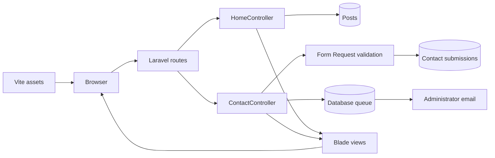

# AMSET Website

Laravel rebuild of [amsetweb.net](https://amsetweb.net) for the Association of Muslim Scientists, Engineers & Technology Professionals. The application is replacing the existing WordPress site with a responsive, maintainable PHP application.

## Current Status

Implemented:

- Responsive AMSET homepage using the original public logo
- Initiative entry points for AI Advocacy, Science Fair, webinars, and contributions
- Initial AMSE-to-AMSET legacy presentation
- Contact and membership-interest form
- Server-side validation and contact submission persistence
- Queued administrator email notification
- Filament administration portal for pages, posts, initiatives, people, timeline events, conferences, galleries, and contact submissions
- Public About/history, conference archive, news, scientist directory, and event-gallery pages
- Idempotent, curated WordPress REST importer with HTML sanitization
- Realistic SQLite sample data and environment-configurable local administrator
- Portable database migrations for SQLite and MySQL
- macOS and Windows setup and local-launch scripts

Payment-provider integration, recurring donations, complete membership renewal/directory workflows, reporting, and production user-role management remain planned work. Event ticketing and check-in are intentionally excluded pending confirmation because the requirements document marks that scope as potentially unnecessary.

## Technology Stack

| Area | Technology |
| --- | --- |
| Application | Laravel 13 |
| Runtime | PHP 8.3 or newer |
| Templates | Laravel Blade |
| Styles | Tailwind CSS 4 plus project CSS |
| Assets | Vite 8 |
| Development database | SQLite |
| Production database | MySQL |
| Email | Laravel Mail with a queued mailable |
| Tests | PHPUnit 12 |
| Formatting | Laravel Pint |

Node.js `22.12` or newer is required by the current Vite toolchain.

## Technical Architecture

The application is server-rendered. Browser requests enter through Laravel routes, controllers coordinate behavior, Eloquent models persist data, and Blade renders HTML. Vite compiles CSS and JavaScript into versioned files under `public/build`.



### Request Flows

**Homepage:** `GET /` invokes `HomeController`, loads the latest published posts, and renders the responsive homepage.

**Contact form:** `GET /contact-us` renders the form. `POST /contact-us` validates input, inserts a `contact_submissions` record, queues `ContactSubmissionReceived`, and redirects with a success message.

The default queue connection is database-backed. Run a queue worker when email should actually be delivered:

```bash
php artisan queue:work
```

Local mail uses the log driver by default, so messages are written to Laravel logs instead of sent externally.

### Database Portability

Local development uses `database/database.sqlite`:

```dotenv
DB_CONNECTION=sqlite
```

Production uses environment-provided MySQL credentials:

```dotenv
DB_CONNECTION=mysql
DB_HOST=127.0.0.1
DB_PORT=3306
DB_DATABASE=amset
DB_USERNAME=amset
DB_PASSWORD=secret-from-host
```

No PHP code changes are required when switching databases. Migrations use Laravel Schema APIs supported by both engines. The local SQLite file must not be deployed; production schema and content are created through migrations, seeders, and import commands.

### Using the Local SQLite Database

SQLite is embedded and does not require a separate database server. Laravel opens `database/database.sqlite` directly through the `DB_CONNECTION=sqlite` setting in `.env`.

From the project root, open the database with the SQLite command-line client:

```bash
sqlite3 database/database.sqlite
```

Install the client on macOS if the command is unavailable:

```bash
brew install sqlite
```

Useful commands inside the SQLite prompt:

```sql
.tables
.schema users
.schema conferences
.headers on
.mode column

SELECT id, name, email, is_admin FROM users;
SELECT id, title, slug, is_published FROM conferences ORDER BY title DESC;
SELECT category, COUNT(*) AS total FROM posts GROUP BY category;

.quit
```

A query can also be executed without opening the interactive prompt:

```bash
sqlite3 -header -column database/database.sqlite \
	"SELECT id, title, slug FROM conferences ORDER BY title DESC;"
```

Back up the local database before running destructive operations:

```bash
cp database/database.sqlite database/database.backup.sqlite
```

Use Artisan to inspect migration status, apply pending schema changes, and load sample data:

```bash
php artisan migrate:status
php artisan migrate
php artisan db:seed --force
```

Do not run `php artisan migrate:fresh` against a database whose data must be retained. That command drops all tables before recreating them.

### Shared Schema for SQLite and MySQL

The authoritative database schema is defined in the PHP migration files under `database/migrations/`. These files use Laravel's `Schema` and `Blueprint` APIs to create tables, columns, indexes, and foreign keys in a database-independent form. Laravel translates the same migrations into SQLite SQL during local development and MySQL SQL in production.

Important schema locations include:

| Migration | Tables or responsibility |
| --- | --- |
| `database/migrations/0001_01_01_000000_create_users_table.php` | Users, password-reset tokens, and sessions |
| `database/migrations/0001_01_01_000001_create_cache_table.php` | Application cache and cache locks |
| `database/migrations/0001_01_01_000002_create_jobs_table.php` | Queued jobs, batches, and failed jobs |
| `database/migrations/2026_09_15_000000_create_pages_table.php` | Managed static pages |
| `database/migrations/2026_09_15_000001_create_posts_table.php` | News, imported articles, and categorized posts |
| `database/migrations/2026_09_15_000002_create_contact_submissions_table.php` | Contact and membership-interest submissions |
| `database/migrations/2026_09_16_000000_create_managed_content_tables.php` | Admin flag, initiatives, people, timeline events, conferences, galleries, and gallery items |

The Eloquent classes under `app/Models/` define how application code reads and writes those tables, but migrations define the actual database structure. `database/seeders/DatabaseSeeder.php` inserts initial/sample records; it does not define tables.

The durable application tables are summarized below. Laravel also creates framework-support tables for migrations, password resets, sessions, cache, and queues.

| Table | Important columns | Relationship or purpose |
| --- | --- | --- |
| `users` | `name`, `email`, `password`, `is_admin` | Login identities and Filament admin authorization |
| `pages` | `title`, `slug`, `summary`, `body`, `meta`, `is_published` | Managed static and imported WordPress pages |
| `posts` | `title`, `slug`, `body`, `category`, `published_at` | News, scientist profiles, and imported articles |
| `contact_submissions` | `inquiry_type`, `name`, `email`, `message` | Contact and membership-interest form records |
| `initiatives` | `name`, `slug`, `description`, `sort_order`, `is_published` | Ordered homepage program links |
| `people` | `name`, `slug`, `role`, `institution`, `type` | Executive team members and scientists |
| `timeline_events` | `year`, `title`, `description`, `sort_order` | Ordered AMSE-to-AMSET history milestones |
| `conferences` | `title`, `slug`, dates, `body`, `program_url` | Conference archive managed by Filament |
| `galleries` | `title`, `slug`, `event_date`, `is_published` | Event albums; one gallery has many gallery items |
| `gallery_items` | `gallery_id`, `image`, `caption`, `sort_order` | Images belonging to `galleries`; deleted when their gallery is deleted |

To create the schema in production MySQL, configure the production `.env` from `.env.production.example`:

```dotenv
DB_CONNECTION=mysql
DB_HOST=127.0.0.1
DB_PORT=3306
DB_DATABASE=amset
DB_USERNAME=amset
DB_PASSWORD=secure-production-password
```

After creating an empty MySQL database and granting the configured user access, run:

```bash
php artisan config:clear
php artisan migrate:status
php artisan migrate --force
```

Use `--force` only for intentional production migrations. Do not copy `database/database.sqlite` into production and do not manually recreate the SQLite schema in MySQL; running the Laravel migrations is the supported and repeatable process.

### Create MySQL Schema or Transfer SQLite Data

The `amset:sqlite-to-mysql` command creates the target schema from Laravel migrations and can then copy durable application records from SQLite. It does not translate SQLite `CREATE TABLE` statements. Cache, sessions, password-reset tokens, queued jobs, failed jobs, and migration-history rows are intentionally not copied.

Add the target connection to the local `.env` file. Keep the active application connection as SQLite while performing the transfer:

```dotenv
DB_CONNECTION=sqlite

# Optional; the default is database/database.sqlite.
# SQLITE_IMPORT_DATABASE=/absolute/path/to/database/database.sqlite

MYSQL_IMPORT_HOST=127.0.0.1
MYSQL_IMPORT_PORT=3306
MYSQL_IMPORT_DATABASE=amset
MYSQL_IMPORT_USERNAME=amset
MYSQL_IMPORT_PASSWORD=secure-mysql-password
```

Create the MySQL database when the configured user has `CREATE DATABASE` permission, run all migrations, and copy application data:

```bash
./scripts/sqlite-to-mysql.sh --create-database
```

On Windows PowerShell:

```powershell
.\scripts\sqlite-to-mysql.ps1 --create-database
```

The cross-platform Artisan command can also be run directly:

```bash
php artisan amset:sqlite-to-mysql --create-database
```

Common modes:

```bash
# Create or update only the MySQL schema; do not copy records.
php artisan amset:sqlite-to-mysql --create-database --schema-only

# Apply pending migrations and upsert SQLite records into an existing database.
php artisan amset:sqlite-to-mysql

# Drop every target table, recreate the schema, and copy all durable records.
php artisan amset:sqlite-to-mysql --fresh --force

# Change the copy batch size for constrained environments.
php artisan amset:sqlite-to-mysql --chunk=100
```

Without `--fresh`, records are upserted by primary key: matching rows are updated and new rows are inserted, but target-only rows are retained. `--fresh --force` produces a clean replacement and permanently deletes all existing tables and data in the configured target database. Back up production MySQL before using it.

The command validates both PDO drivers, the SQLite source, target settings, chunk size, and database name before migration. `--create-database` requires broader MySQL privileges; omit it when a hosting provider has already created the database. Uploaded files referenced by database records are not stored in SQLite and must be copied separately from `storage/app/public` or the applicable public asset directory.

#### Transfer Prerequisites

- PHP must have both `pdo_sqlite` and `pdo_mysql` enabled.
- `database/database.sqlite`, or the file configured by `SQLITE_IMPORT_DATABASE`, must exist and be readable.
- The MySQL server must be running and reachable from the machine performing the transfer.
- The configured MySQL user must have permission to create and modify tables in the target database.
- The user also needs `CREATE DATABASE` permission only when `--create-database` is used.
- Docker is not required. If MySQL is provided by Docker, Docker Desktop or the Docker daemon must be running first.

Check the PHP database drivers:

```bash
php -r 'foreach (["pdo_sqlite", "pdo_mysql"] as $driver) { echo $driver.": ".(extension_loaded($driver) ? "loaded" : "missing").PHP_EOL; }'
```

After changing `.env`, clear cached configuration before transferring:

```bash
php artisan config:clear
```

If `MYSQL_IMPORT_DATABASE` or `MYSQL_IMPORT_USERNAME` is absent, the command exits safely before connecting to MySQL or changing SQLite:

```text
Set MYSQL_IMPORT_DATABASE and MYSQL_IMPORT_USERNAME in .env first.
```

#### Verify the Transfer

First confirm that MySQL recorded all Laravel migrations:

```bash
mysql -h 127.0.0.1 -P 3306 -u amset -p amset \
	-e "SELECT migration, batch FROM migrations ORDER BY batch, migration;"
```

Compare important source and target row counts. The MySQL client prompts for the password, keeping it out of shell history:

```bash
sqlite3 database/database.sqlite \
	"SELECT 'users', COUNT(*) FROM users UNION ALL SELECT 'pages', COUNT(*) FROM pages UNION ALL SELECT 'posts', COUNT(*) FROM posts UNION ALL SELECT 'conferences', COUNT(*) FROM conferences;"

mysql -h 127.0.0.1 -P 3306 -u amset -p amset \
	-e "SELECT 'users' AS table_name, COUNT(*) AS rows_count FROM users UNION ALL SELECT 'pages', COUNT(*) FROM pages UNION ALL SELECT 'posts', COUNT(*) FROM posts UNION ALL SELECT 'conferences', COUNT(*) FROM conferences;"
```

The source and target counts should match after a clean `--fresh --force` transfer. Without `--fresh`, target-only records are intentionally retained, so target counts can be higher. Also verify the application against MySQL in a staging environment before changing production traffic:

```bash
php artisan migrate:status
php artisan test
```

The automated test suite verifies command registration, required configuration, invalid chunk-size handling, and existing application behavior without requiring MySQL. A real end-to-end transfer is complete only after the command succeeds against the intended MySQL server and the schema and row counts are verified there.

## Technical Documentation

### Folder Reference

| Folder | Purpose |
| --- | --- |
| `.claude/` | Optional AI-assisted development instructions and Laravel workflow skills. It is not required at runtime. |
| `.tools/` | Generated project-local PHP, Node.js, Composer wrappers, downloads, and caches used by the setup scripts. Do not deploy this folder. |
| `app/` | Main application source code. It contains commands, controllers, validation requests, Filament admin resources, mail classes, Eloquent models, and service providers. |
| `app/Console/Commands/` | Custom Artisan commands, including the curated WordPress content importer. |
| `app/Filament/Resources/` | Admin portal CRUD definitions, forms, tables, pages, and relation managers. |
| `app/Http/Controllers/` | Public request handling for the homepage, content sections, and contact form. |
| `app/Http/Requests/` | Reusable request authorization and validation rules. |
| `app/Mail/` | Email message classes, including the queued contact-submission notification. |
| `app/Models/` | Eloquent models for users, pages, posts, initiatives, people, conferences, timeline events, galleries, and contact submissions. |
| `app/Providers/` | Application and Filament panel registration and configuration. |
| `bootstrap/` | Laravel startup configuration, provider registration, and generated framework cache files. |
| `config/` | Application configuration for authentication, database, mail, queues, sessions, filesystems, and AMSET-specific settings. Values normally come from `.env`. |
| `database/` | Database migrations, factories, seeders, and the ignored local SQLite database. Migrations remain portable between SQLite and MySQL. |
| `node_modules/` | Generated frontend dependencies installed by npm. Do not edit or deploy this folder directly. |
| `public/` | Web server document root containing `index.php`, built Vite assets, Filament assets, images, fonts, and other publicly accessible files. |
| `resources/` | Source Blade templates, CSS, and JavaScript compiled or rendered by Laravel and Vite. |
| `routes/` | HTTP route definitions that connect URLs to controllers and public workflows. |
| `scripts/` | macOS and Windows setup, build, migration, port cleanup, and local-launch automation. |
| `storage/` | Runtime logs, cache, sessions, compiled views, queued files, and application uploads. The web server must be able to write here. |
| `tests/` | PHPUnit feature and unit tests for public pages, contact submission, content, and admin authorization. |
| `vendor/` | Generated PHP and Laravel dependencies installed by Composer. Do not edit this folder. |

### Critical Files

| File | Purpose |
| --- | --- |
| `.env` | Active machine-specific configuration and secrets. It is ignored by Git and must not be committed. |
| `.env.example` | Safe local configuration template, including SQLite and sample admin settings. It does not control a running application unless copied to `.env`. |
| `.env.production.example` | Secret-free production template for MySQL, mail, queues, sessions, and deployment settings. |
| `artisan` | Laravel command-line entry point for migrations, seeders, imports, queues, tests, and maintenance commands. |
| `app/Console/Commands/ImportWordPressContent.php` | Idempotently imports allowlisted pages, posts, scientists, and conference programs from the legacy WordPress REST API. |
| `app/Console/Commands/TransferSqliteToMysql.php` | Creates or migrates a target MySQL schema and copies durable application records from SQLite. |
| `app/Http/Controllers/HomeController.php` | Loads published homepage initiatives and recent news. |
| `app/Http/Controllers/PublicContentController.php` | Loads About, conferences, news, scientists, and gallery content from the database. |
| `app/Http/Controllers/ContactController.php` | Stores validated contact or membership inquiries and queues administrator email. |
| `app/Models/User.php` | Authenticated user model and Filament admin-panel access check. |
| `app/Providers/Filament/AdminPanelProvider.php` | Configures the `/admin` panel, login, branding, resource discovery, middleware, and widgets. |
| `bootstrap/app.php` | Creates the Laravel application and configures framework routing, middleware, and exception handling. |
| `bootstrap/providers.php` | Registers application service providers, including the Filament admin panel. |
| `composer.json` / `composer.lock` | Declare and lock PHP dependencies such as Laravel and Filament. |
| `package.json` / `package-lock.json` | Declare and lock frontend build dependencies such as Vite and Tailwind CSS. |
| `database/migrations/` | Defines the complete database schema; run migrations after schema changes. |
| `database/seeders/DatabaseSeeder.php` | Idempotently creates the local administrator and realistic sample content. |
| `resources/views/layouts/app.blade.php` | Shared public HTML layout, header navigation, metadata, and footer. |
| `resources/css/app.css` | Responsive public visual system and page/component styling. |
| `resources/js/app.js` | Accessible responsive navigation behavior. |
| `routes/web.php` | Defines public website and contact-form routes. Filament registers its admin routes through its panel provider. |
| `scripts/setup-macos.sh` / `scripts/setup-windows.ps1` | Prepare runtime tools, dependencies, environment, database, and frontend assets. |
| `scripts/start-local.sh` / `scripts/start-local.ps1` | Build, migrate, stop an existing port listener, and launch the local Laravel server. |
| `scripts/sqlite-to-mysql.sh` / `scripts/sqlite-to-mysql.ps1` | Platform wrappers for the SQLite-to-MySQL schema creation and data transfer command. |
| `phpunit.xml` | PHPUnit test environment and suite configuration. |
| `vite.config.js` | Frontend entry points and Vite/Tailwind build configuration. |

Generated folders such as `vendor/`, `node_modules/`, `public/build/`, and framework cache contents under `bootstrap/cache/` and `storage/framework/` should be regenerated through Composer, npm, Vite, and Artisan rather than edited manually.

## Local Development

The project uses Laravel 13 with PHP 8.3 or newer. Local development uses SQLite; production uses MySQL. The application code and migrations are shared across both environments.

### Automated Setup

The setup scripts install project-local Composer and Node.js 22 under `.tools/`, install dependencies, configure SQLite, run migrations, and build frontend assets. Re-running either script is safe: compatible tools and existing environment values are preserved.

#### macOS

```bash
./scripts/setup-macos.sh
.tools/bin/amset .tools/bin/php artisan serve
```

PHP 8.3 is installed with Homebrew because PHP does not publish a portable macOS binary. Node.js, Composer, wrappers, downloads, and caches remain inside `.tools/`. On older Intel Macs, Homebrew may need to compile dependencies and request confirmation.

#### Windows

From PowerShell:

```powershell
Set-ExecutionPolicy -Scope Process Bypass
.\scripts\setup-windows.ps1
.\.tools\bin\php.cmd artisan serve
```

The Windows script installs portable PHP 8.3, Node.js 22, Composer, wrappers, and caches under `.tools/`. It does not modify the machine PATH.

Open `http://localhost:8000` after starting Laravel. For frontend development, run `npm run dev` in a second terminal using the project-local Node executable.

### Build and Launch

After the initial setup, one command installs locked dependencies, applies pending SQLite migrations, builds production assets, and starts the local server:

macOS:

```bash
./scripts/start-local.sh
```

Windows PowerShell:

```powershell
.\scripts\start-local.ps1
```

The default URL is `http://127.0.0.1:8000`. Before launch, the script stops any process already listening on the selected port. Override the port when you need to keep that process running:

```bash
./scripts/start-local.sh --host=127.0.0.1 --port=8001
```

```powershell
.\scripts\start-local.ps1 -HostAddress 127.0.0.1 -Port 8001
```

Use `--check` on macOS or `-CheckOnly` on Windows to run the complete build without launching the long-running server.

### Daily Commands

macOS:

```bash
.tools/bin/amset .tools/bin/php artisan serve
.tools/bin/amset npm run dev
.tools/bin/amset .tools/bin/php artisan test
```

Windows PowerShell:

```powershell
.\.tools\bin\php.cmd artisan serve
.\.tools\node\npm.cmd run dev
.\.tools\bin\php.cmd artisan test
```

Common commands:

```bash
php artisan migrate
php artisan db:seed
php artisan amset:import-wordpress
php artisan queue:work
php artisan test
vendor/bin/pint
npm run dev
npm run build
```

### Local SQLite

`.env.example` selects SQLite and the setup scripts create `database/database.sqlite`. Reset local data with:

```bash
php artisan migrate:fresh --seed
```

This command deletes all local database records. Do not run it in production.

### Administration And Sample Content

Run the idempotent seeder, then sign in at `http://127.0.0.1:8000/admin`:

```bash
php artisan db:seed
```

The development defaults are `admin@amsetweb.test` and `ChangeMe!123`. Override `AMSET_ADMIN_EMAIL` and `AMSET_ADMIN_PASSWORD` in `.env`, especially outside a disposable local environment.

To refresh approved legacy content from the public WordPress REST API:

```bash
php artisan amset:import-wordpress
```

The importer allowlists legitimate AMSET sections and categories, sanitizes imported HTML, and upserts by slug. It excludes WordPress authentication/plugin pages and unrelated or suspicious posts instead of copying the legacy database blindly.

### Troubleshooting

- Confirm the active runtime with `php -v`, `php -m`, `node --version`, and `composer --version` through the `.tools/bin` wrappers.
- If Vite reports a missing native binding, remove generated `node_modules` and `package-lock.json`, rerun the setup script, and confirm Node is at least 22.12.
- If Laravel reports a missing Vite manifest, run `npm run build`.
- Ensure `storage/` and `bootstrap/cache/` are writable.
- Mail is logged locally. Production SMTP values belong only in the production environment.

### Production MySQL

Copy `.env.production.example` to a secure environment outside source control and provide real values for:

```dotenv
DB_CONNECTION=mysql
DB_HOST=your-database-host
DB_PORT=3306
DB_DATABASE=your-database-name
DB_USERNAME=your-database-user
DB_PASSWORD=your-secret-password
```

Do not upload `.env`, `.tools/`, `node_modules/`, or `database/database.sqlite`. On the production host, install dependencies, inject environment variables, and run:

```bash
composer install --no-dev --optimize-autoloader
npm ci && npm run build
php artisan config:clear
php artisan migrate --force
php artisan storage:link
php artisan config:cache
php artisan route:cache
php artisan view:cache
```

Back up MySQL before migrations. Run the migration and test suite against a disposable MySQL database in staging before the first production release. The SQLite file is not converted or uploaded; content moves through migrations, seeders, and the WordPress importer.

## Environment Files

The application uses `.env` files to manage environment-specific configuration. Files are not committed to Git; configuration values are injected at runtime.

### Development Environment (.env)

Copy `.env.example` to `.env` for local development. The setup scripts create this automatically:

```dotenv
APP_NAME=AMSET
APP_ENV=local
APP_KEY=                    # Generated by setup scripts
APP_DEBUG=true              # Enable debug mode and error details
APP_URL=http://localhost:8000

DB_CONNECTION=sqlite        # Use embedded SQLite locally
# DB_HOST, DB_PORT, DB_USERNAME, DB_PASSWORD not needed for SQLite

LOG_CHANNEL=stack
LOG_LEVEL=debug             # Verbose logging for development

CACHE_STORE=database        # Optional: use database caching
QUEUE_CONNECTION=database   # Database-backed queue for local testing

SESSION_DRIVER=database
SESSION_LIFETIME=120

MAIL_MAILER=log             # Log emails instead of sending (check storage/logs/laravel.log)
MAIL_FROM_ADDRESS=local@amsetweb.test

AMSET_ADMIN_EMAIL=admin@amsetweb.test
AMSET_ADMIN_PASSWORD=ChangeMe!123

# Optional: Override these to test SQLite→MySQL migration locally
# MYSQL_IMPORT_HOST=127.0.0.1
# MYSQL_IMPORT_PORT=3306
# MYSQL_IMPORT_DATABASE=
# MYSQL_IMPORT_USERNAME=
# MYSQL_IMPORT_PASSWORD=
```

**Key development settings:**
- `APP_ENV=local` and `APP_DEBUG=true` enable detailed error pages and logging
- `DB_CONNECTION=sqlite` uses the embedded `database/database.sqlite` file
- `MAIL_MAILER=log` logs emails to `storage/logs/` instead of sending them
- `LOG_LEVEL=debug` captures verbose application events
- Database queue allows testing queued jobs without a background worker

### Production Environment (.env.production)

Copy `.env.production.example` to a secure environment outside source control and inject real values. This file is never committed:

```dotenv
APP_NAME=AMSET
APP_ENV=production          # Critical: enable production mode
APP_KEY=                    # Inject via environment variable or secure vault
APP_DEBUG=false             # NEVER enable debug in production
APP_URL=https://amsetweb.net  # Your live domain

# Database: MySQL only (never SQLite in production)
DB_CONNECTION=mysql
DB_HOST=your-db-host        # Inject securely (no hardcoded credentials)
DB_PORT=3306
DB_DATABASE=amset
DB_USERNAME=amset           # Use principle of least privilege
DB_PASSWORD=secure-password # Inject from secrets manager

LOG_CHANNEL=stack
LOG_LEVEL=warning           # Only log important events

CACHE_STORE=database        # Consider Redis or file-based caching for performance
QUEUE_CONNECTION=database   # Consider Redis for high-volume queues

SESSION_DRIVER=database
SESSION_ENCRYPT=true        # Encrypt session data in database

MAIL_MAILER=smtp            # Use real SMTP provider
MAIL_HOST=mail.example.com
MAIL_PORT=587
MAIL_USERNAME=noreply@example.com
MAIL_PASSWORD=app-password  # Use app-specific password, not user password
MAIL_ENCRYPTION=tls
MAIL_FROM_ADDRESS=info@amsetweb.net
MAIL_FROM_NAME="AMSET"

AMSET_CONTACT_EMAIL=info@amsetweb.net
```

**Key production settings:**
- `APP_ENV=production` and `APP_DEBUG=false` disable error details and debug toolbar
- `DB_CONNECTION=mysql` uses MySQL (created via migrations, never uploaded from SQLite)
- `MAIL_MAILER=smtp` sends real emails via SMTP provider
- `SESSION_ENCRYPT=true` protects session data
- Credentials are **never hardcoded**; inject via:
  - Environment variables set by hosting platform
  - Secrets manager (AWS Secrets Manager, Vault, etc.)
  - Secure .env file created on the production server during deployment

### Configuration Checklist

| Setting | Development | Production | Notes |
| --- | --- | --- | --- |
| `APP_ENV` | `local` | `production` | Controls Laravel behavior and error handling |
| `APP_DEBUG` | `true` | `false` | Never expose stack traces in production |
| `DB_CONNECTION` | `sqlite` | `mysql` | SQLite not suitable for production traffic |
| `MAIL_MAILER` | `log` | `smtp` | Emails logged locally, sent via SMTP in production |
| `LOG_LEVEL` | `debug` | `warning` | Verbose local logging, minimal production logging |
| `CACHE_STORE` | `database` | `database` or `redis` | Database sufficient for small deployments |
| `SESSION_ENCRYPT` | `false` | `true` | Encrypt sensitive session data in production |
| Credentials | Safe defaults (test user) | Injected securely | Never commit real credentials |

### Important Security Notes

- **Never commit `.env`** — it contains secrets and is in `.gitignore`
- **Never hardcode credentials** — use environment variables, secrets managers, or secure vaults
- **Never deploy SQLite** — it's local-only; production uses MySQL
- **Never enable debug in production** — it exposes sensitive paths and configuration
- **Rotate credentials regularly** — database passwords, API keys, SMTP passwords
- **Use strong passwords** — at least 16 characters for database and application users
- **Inject secrets safely** — use your platform's secrets manager (not plaintext .env files)

## Deployment Outline

1. Configure the web root to the Laravel `public/` directory.
2. Provide PHP 8.3 or newer with the required PDO MySQL extension.
3. Inject production environment values securely.
4. Install optimized PHP dependencies and compile frontend assets.
5. Back up MySQL and apply migrations.
6. Create the public storage link.
7. Start a queue worker for queued contact email.
8. Cache Laravel configuration, routes, and views.

```bash
composer install --no-dev --optimize-autoloader
npm ci
npm run build
php artisan config:clear
php artisan migrate --force
php artisan storage:link
php artisan config:cache
php artisan route:cache
php artisan view:cache
php artisan queue:work
```

Do not deploy `.tools`, `.env`, `node_modules`, or `database/database.sqlite`.

## Tests and Quality Checks

```bash
php artisan test
vendor/bin/pint
npm run build
```

Feature tests cover homepage content and responsive-navigation markup, contact page availability, validation, database persistence, and queued mail notification.

## MCP, Claude, and Laravel Boost

The website does **not** need `.mcp.json`, `CLAUDE.md`, `.claude/`, or `boost.json` to run, build, test, or deploy. These files support optional AI-assisted development and are not loaded during a normal web request.

| File or directory | Purpose | Required for the website? |
| --- | --- | --- |
| `.mcp.json` | Registers `php artisan boost:mcp` as a project Model Context Protocol server for compatible AI clients | No |
| `.claude/` | Laravel, testing, Tailwind, and deployment skills generated for Claude Code | No |
| `CLAUDE.md` | Project coding guidance read by Claude Code | No |
| `boost.json` | Records which agents, guidelines, MCP integration, and skills Laravel Boost generated | No |
| `laravel/boost` | Development-only Composer package providing Laravel-aware AI tools | No |

MCP is a protocol that lets an AI coding client request structured, project-aware operations. Here, Laravel Boost exposes framework documentation and development diagnostics through an Artisan process. It does not expose a public website endpoint, and production does not need an MCP process.

The current `boost.json` targets `claude_code`, which is why `.claude/` exists. Keep these files if the team uses Claude Code or Laravel Boost. They may be removed if the team does not use those tools. To remove Boost completely, delete its generated metadata and run:

```bash
composer remove laravel/boost --dev
```

Removing optional AI tooling does not change routes, database behavior, assets, tests, or production deployment. Exclude `.claude/`, `CLAUDE.md`, `.mcp.json`, and `boost.json` from production artifacts unless development metadata is intentionally included.

## Source Requirements

The approved business requirements are retained as:

- `AMSET Webpage Requirements September 15 2026.pdf`
- `AMSET Webpage Requirements September 15 2026.docx`

The legacy WordPress site remains the source for approved content and public media until migration is complete.
